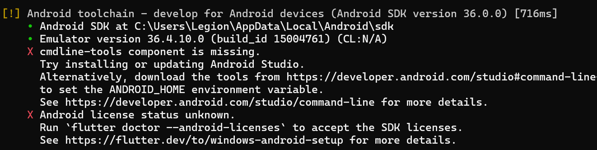
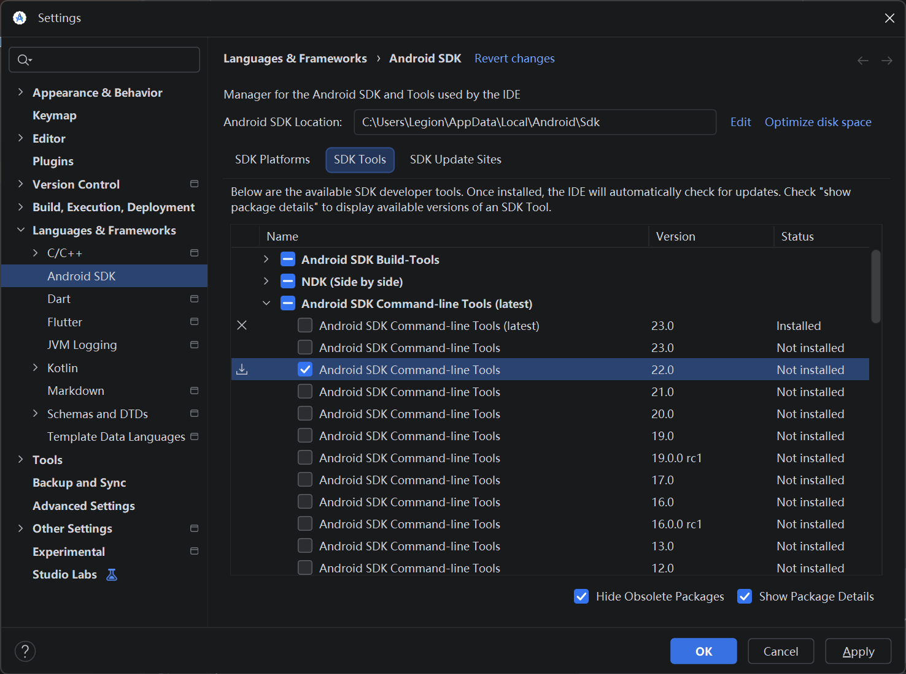
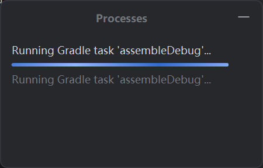
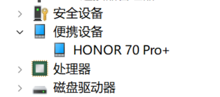
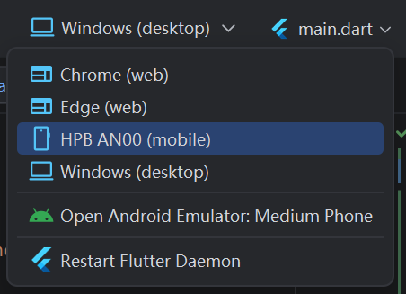

# Flutter 环境安装

!!! info "本文环境"
    本文主要记录在 `Windows` 上安装 `Flutter` 开发环境的流程，目标是让 `flutter doctor` 检查通过，并能够创建、运行一个基础项目。

## 安装 Flutter SDK


根据 [Flutter 官网](https://docs.flutter.dev/get-started/install){:target="_blank"} 指导使用 `vscode` 安装 `Flutter SDK`，也可手动安装。
安装完成后重新打开终端，执行下面的命令检查是否安装成功：

``` powershell
flutter doctor -v
```

!!! tip "路径建议"
    `Flutter SDK` 目录尽量不要放在需要管理员权限的目录中，例如 `C:\Program Files`。路径中也尽量避免中文和空格，这样可以减少后续工具链识别异常的概率。

## 安装 Android Studio

`Flutter` 开发移动端应用时通常还需要 `Android Studio` 提供 `Android SDK`、模拟器和相关构建工具。

1. 前往 [Android Studio 官网](https://developer.android.com/studio){:target="_blank"} 下载并安装。
2. 打开 `Android Studio`，进入 `Settings`。
3. 找到 `Languages & Frameworks` -> `Android SDK`。
4. 在 `SDK Platforms` 中安装一个稳定版本的 `Android SDK Platform`。
5. 在 `SDK Tools` 中勾选常用工具：
    - `Android SDK Build-Tools`
    - `Android SDK Platform-Tools`
    - `Android SDK Command-line Tools`
    - `Android Emulator`
    - `CMake`
    - `NDK (Side by side)`

!!! note "Flutter 插件"
    如果使用 `Android Studio` 编写 `Flutter` 项目，可以在 `Plugins` 中安装 `Flutter` 插件。安装 `Flutter` 插件时通常会自动提示安装 `Dart` 插件。

## Questions

### 处理 cmdline-tools missing && license status unknown

!!! warning "命令行错误提示"
    

如果 `flutter doctor` 出现 `cmdline-tools component is missing`，说明当前 `Android SDK` 中没有安装命令行工具组件。

解决方法：

1. 打开 `Android Studio`。
2. 进入 `Settings` -> `Languages & Frameworks` -> `Android SDK`。
3. 切换到 `SDK Tools`。
4. 勾选 `Android SDK Command-line Tools`。
5. 点击 `Apply`，等待下载和安装完成。

对于许可证问题，根据提示需执行命令

``` powershell
flutter doctor --android-licenses
```

但是如果安装了 `Command-line Tools(latest)`，运行该命令可能会提示

```powershell
PS C:\xxx\xxx> flutter doctor --android-licenses
WARNING: The SDK Manager CLI tool (sdkmanager) is deprecated. Android CLI will be used instead.
The 'android' binary can also be found in the cmdline-tools directory, and 'android sdk' is the replacement for 'sdkmanager'.
To learn more about the Android CLI and how to use it, see the documentation (https://d.android.com/tools/agents/android-cli)
```

因为最新的 `SDK` 不再支持传统的 `sdkmanager` 工具，转为使用 `Android CLI`，但是即便安装 `Android`，也不存在 `android sdk --licenses` 命令

根据 [Github issue](https://github.com/flutter/flutter/issues/189936) 中的 `command`，我们可以在 `Android Studio` 的 `Settings` -> `Languages & Frameworks` -> `Android SDK` -> `SDK Tools`
目录中勾选 `Show Package Details`，并选择 `22.0` 版本的 `cmdline-tools` 进行下载



最后再执行如下命令
```powershell
flutter doctor --android-licenses
```


!!! note "注意不要换回 `latest` 版本，否则证书会失效"

### 安装 Dart

如果已经安装 `flutter`，会自动安装 `dart`，也可以通过 [Dart 官网](https://dart.dev/get-dart){:target="_blank"} 安装

### 更改 Android Studio 虚拟机保存位置

`Android Studio` 虚拟机（`AVD`）默认保存在 `$HOME/.android/avd/` 中，想要更改到其他盘，可以添加系统变量 `ANDROID_AVD_HOME` 并设置成
你想保存的位置，如 `D:\Android\avd`，重启 IDE 即可。原有的虚拟机需要删除重新下载。

### 解决 assembleDebug 卡死问题
第一次运行 `Flutter` 应用时，可能会出现 `assembleDebug` 卡死问题



可以参考 [使用Android Studio生成apk，卡在Running Gradle task assembleDebug...解决方法](https://blog.csdn.net/Curtisjia/article/details/156773879)
在 `flutter\packages\flutter_tools\gradle` 目录下 `resolve_dependencies.gradle.kts`，项目文件内 `android` 目录下 `build.gradle.kts`、`settings.gradle.kts`
等文件的 `repositories` 中添加国内阿里云镜像

```kotlin
maven { url = uri("https://maven.aliyun.com/repository/gradle-plugin") }
maven { url = uri("https://maven.aliyun.com/repository/google") }
maven { url = uri("https://maven.aliyun.com/repository/public") }
```

同时再修改 `android/gradle/wrapper` 目录下的 `gradle-wrapper.properties` 文件，将 `distributionUrl` 替换为腾讯云镜像 `https://mirrors.cloud.tencent.com/gradle/gradle-x.x.x-all.zip`

### 如何使用 Android Studio 真机调试 Flutter 应用

1. 需要一台安卓手机（有些手机可能有自己的操作系统，但基本会有安卓内核），在设置里找到版本号并连续 7 次点击，即可开启开发者模式
2. 找到开发者选项，打开`USB`调试、`USB`安装等设置（不同手机可能会有所不同）
3. 使用 `USB` 连接电脑（注意一定要用可传输数据的数据线）
4. 注意一定要把 `USB` 传输模式调成以太网，不要是仅充电！！！
5. 在 `Android Studio` 的 `Android SDK / SDK Tools` 中安装 `Google USB Driver` 以及手机安卓版本对应的 `Android SDK`
6. 打开设备管理器，点击便携设备项，应当可以看到手机（一般为手机型号） 
7. 右键手机更新驱动
8. 即可在设备选择中找到手机（找不到的话一定得注意一下第四步） 
   