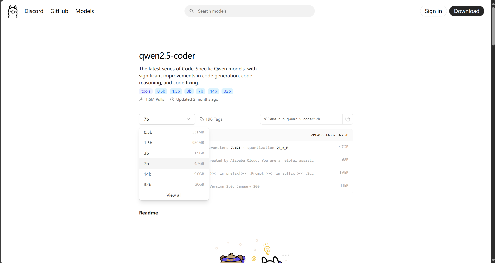
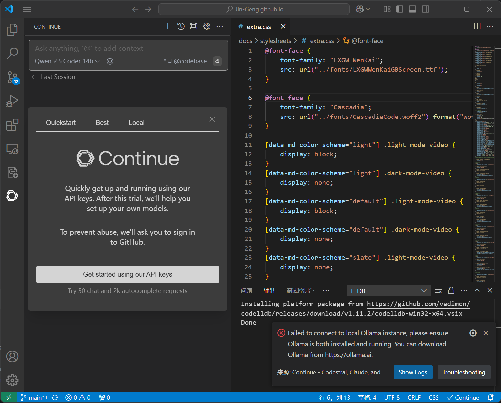

# 搭建本地代码AI助手

???+ info "起因"
    在B站看到一个视频，可以使用`vscode + ollama + qwen`搭建一个免费的本地代码助手来作为 cursor 的下位替代。看着蛮有意思的就试了试，
    视频放在这里了，有兴趣的可以直接看😋
    <iframe src="//player.bilibili.com/player.html?isOutside=true&aid=113792172163702&bvid=BV12krYYmEn7&cid=27763017100&p=1&autoplay=0" scrolling="no" border="0" frameborder="no" framespacing="0" allowfullscreen="true"  style="width:100%; height:380px; object-fit:cover;"></iframe>
    
首先前往[Ollama官网](https://ollama.com/)下载`Ollama`本地客户端，下载安装后，在官网搜索`qwen2.5-coder`，可以选择安装不同大小的模型（一般选择14b及以下的版本，否则显存不够），
随后在`cmd`运行列表右上方的安装代码（如图为`ollama run qwen2.5-coder:7b`）

!!! tip ""
    

随后在`vscode`中安装`continue`插件，并配置对应模型即可，具体可以参照视频中的方式。
!!! tip ""
    