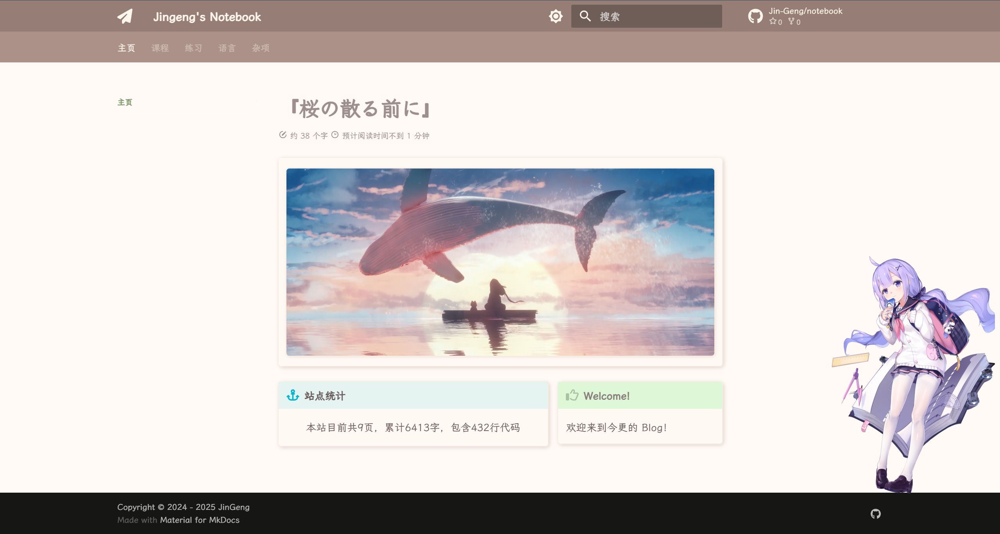

# 添加 live2d 模型
!!! info "如何为静态网站添加live2d模型"
    为网站添加一个`live2d`看板娘的想法源于在B站看到的一条视频：[【1分钟，给你的网站加个看板娘！Live2D保姆级接入教程](https://www.bilibili.com/video/BV1FeUaYDEKr/?share_source=copy_web&vd_source=4ed18fad2a3008a97e81d9d38d12141c){:target=_blank}
    。本文除了该视频外，还参照了两个`github`仓库：[`live2d-widget`](https://github.com/stevenjoezhang/live2d-widget?tab=readme-ov-file){:target=_blank}和[`live2d`](https://github.com/imuncle/live2d){:target=_blank}。

## 一行代码实现？
根据[`live2d-widget`](https://github.com/stevenjoezhang/live2d-widget?tab=readme-ov-file){:target=_blank}仓库，只需要添加如下代码：

``` javascript
<script src="https://fastly.jsdelivr.net/npm/live2d-widgets@0/autoload.js"/>
```

这行代码事实上就是从作者的服务器上获取`js`脚本，从而实现自动加载模型，但这会不利于修改参数和内容。仓库作者对此的解决方法自行`fork`仓库后修改`autoload.js`等文件以实现自定义内容。不过这还是
比较麻烦，而且此仓库的样例模型都较为简陋，还需要自行添加模型。

## 直接加载模型！
在[`live2d`](https://github.com/imuncle/live2d){:target=_blank}仓库中有许多基于`Live2d Cubism 3`的高品质模型，同时作者还提供了一个简易的展示网站，因此可以考虑直接加载其中的模型。
不过这需要修改一部分`js`代码，因为在示例网站中采用的是选择展示，而我们只需要展示特定的一个模型即可。

!!! info "第一步：引入仓库中 live2d_3 文件夹中的内容"
    `live2d_3`中包含`css`、`js`和`model`三个文件夹，其中`model`中包含所有的模型代码（可以自行删除不想要的），`js`中包含模型的加载脚本，同时在需要`live2d`的`markdown`文件中引入其中的脚本。例如本文档在最外层的`index.md`
    中引入，代码如下，注意脚本`src`属性是当前文件到`js`文件的相对路径：

    ``` html linenums="1"
    <div class="Canvas">
        <canvas style="touch-action: none; cursor: inherit;"></canvas>
    </div>
    <script src="./live2d/js/jquery.min.js"></script>
    <script src="./live2d/js/bootstrap.min.js"></script>
    <script src="./live2d/js/live2dcubismcore.min.js"></script>
    <script src="./live2d/js/pixi.min.js"></script>
    <script src="./live2d/js/live2dcubismframework.js"></script>
    <script src="./live2d/js/live2dcubismpixi.js"></script>
    <script src="./live2d/js/charData.js"></script>
    <script src="./live2d/js/l2d.js"></script>
    <script src="./live2d/js/main.js"></script>
    ```

    在`stylesheets/extra.css`中可以添加`Canvas`的`css`，可以自定义模型（包含背景）的大小和位置：

    ``` css linenums="1"
    .Canvas {
        position: absolute;
        right: 10px;
        bottom: 40px;
        width: 300px;
        height: 500px;
    }
    ```

???+ info "第二步：修改 main.js 代码"
    `main.js`中含有主加载函数，修改后的结果可以参照如下代码。其中有以下几点需要注意（高亮部分）：

    1. 第3行中的路径需要根据添加`live2d`的文件的同级目录和`model`文件夹的相对路径进行匹配。
    2. 第15行中的模型路径可以根据想要展示的模型自行修改。
    3. 第20-21、29-30、47-48行中设置的为整个展示区域的宽高，应当一起修改。
    4. 第25行中的`resolution`参数决定了模型的渲染分辨率，越大越高，不过过高会带来较大的启动延迟。
    5. 第54行设置了模型在中心点（`position`）渲染，第55、56、59行设置模型本身的缩放，乘数越大模型显示越大。`0.2`和`300*500`基本相配😋。

    ``` javascript title="main.js" linenums="1" hl_lines="3 15 20-26 29-30 47-48 54-59"

    var v;
    $(document).ready(() => {
        v = new Viewer('live2d/model'); // 模型根文件夹路径
    });
    
    class Viewer {
        constructor(basePath) {
            this.l2d = new L2D(basePath);
    
            this.canvas = $(".Canvas");
            this.selectCharacter = $(".selectCharacter");
            this.selectAnimation = $(".selectAnimation");
    
            // 直接加载指定的模型
            const specificModelPath = "Azue Lane(JP)/dujiaoshou_4"; // 指定模型路径
            this.l2d.load(specificModelPath, this);
    
            // 创建PixiJS应用
            this.app = new PIXI.Application({
                width: 300,
                height: 500,
                backgroundColor: 0x00000000, // 设置背景色为透明
                transparent: true, // 启用透明背景
                antialias: true,
                resolution: 3,
                autoDensity: true,
            });
    
            let width = 300;
            let height = (width / 3.0) * 5.0;
            this.app.view.style.width = width + "px";
            this.app.view.style.height = height + "px";
            this.app.renderer.resize(width, height);
            this.canvas.html(this.app.view);
    
            this.app.ticker.add((deltaTime) => {
                if (!this.model) {
                    return;
                }
    
                this.model.update(deltaTime);
                this.model.masks.update(this.app.renderer);
            });
    
            window.onresize = (event) => {
                if (event === void 0) { event = null; }
                let width = Math.min(300, window.innerWidth);
                let height = (width / 3.0) * 5.0;
                this.app.view.style.width = width + "px";
                this.app.view.style.height = height + "px";
                this.app.renderer.resize(width, height);
    
                if (this.model) {
                    this.model.position = new PIXI.Point((width * 0.5), (height * 0.5));
                    this.model.scale = new PIXI.Point((this.model.position.x * 0.2), (this.model.position.x * 0.2));
                    this.model.masks.resize(this.app.view.width, this.app.view.height);
                }
                if (this.model.height <= 200) {
                    this.model.scale = new PIXI.Point((this.model.position.x * 0.2), (this.model.position.x * 0.2));
                }
            };

            ...

        }
    }
    ```

!!! success "最后一步：看看效果🥰"
    可以修改第一步中的`css`来改变模型显示的位置和大小。
    
