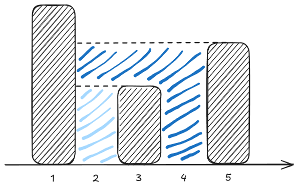
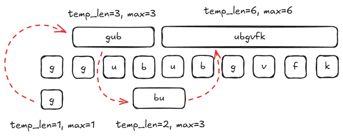

# 热门100题

!!! info "说明"
    本文为笔者练习leetcode热门100题时的思考和感悟，可能会存在一些疏漏

## 哈希

### 两数和
!!! question "两数之和"
    给定一个整数数组`nums`和一个整数目标值`target`，请你在该数组中找出和为目标值`target `的那两个整数，并返回它们的数组下标。 你可以假设每种输入只会对应一个答案，并且你不能使用两次相同的元素。你可以按任意顺序返回答案。

看到这道题的第一反应是暴力解法，遍历数组中的所有两数对直至找到正确解，这用两个`for`循环可以轻松实现。

???+ success "Solution"
    === "C++"
        ``` c++ linenums="1"
        class Solution {
        public:
            vector<int> twoSum(vector<int>& nums, int target) {
                vector<int> result;
                for (int i=0; i<nums.size()-1; i++) {
                    for (int j=i+1; j<nums.size(); j++) {
                        if (nums[i] + nums[j] == target) {
                            result.push_back(i);
                            result.push_back(j);
                            return result;
                        }
                    }
                }
                return result;
            }
        };
        ```

但显然遍历的时间复杂度为$O(N^2)$，在数组较大时的性能堪忧。想要更快地找到解，我们有两个思路：

!!! note ""
    1. 对数组进行操作（显然有序数组可以很方便地在$O(N)$的复杂度内找到解）
    2. 更快地查找数组（哈希表！）

再深入思考一下，使用`qsort`也会带入$O(Nlog(N))$的复杂度，而且排序会影响原本的数组下标，因此使用哈希表是一个更为实惠的选择，毕竟在没有冲突的情况下查找的时间复杂度仅为$O(1)$。

???+ success "哈希解法"
    我们可以将`num1 + num2 = target`变形为`num1 = target - num2`，从而转化为一个查找问题。因此我们以`(nums[i],i)`组成数和对应下标的键值对，再通过遍历的方式进行查找。
    
    === "C++"
        ``` c++ linenums="1" hl_lines="10"
        class Solution {
        public:
            vector<int> twoSum(vector<int>& nums, int target) {
                std::unordered_map<int, int> hash;
                for (int j=0; j<nums.size(); j++) {
                    int remainder = target - nums[j];
                    if (hash.find(remainder) != hash.end() && hash[remainder] != j) {
                        return {j, hash[remainder]};
                    } else {
                        hash[nums[j]] = j;
                    }
                }
                return {};
            }
        };
        ```

    !!! tip "比较有趣的是，我们可以选择在查找哈希表的过程中插入键值对，虽然看起来很怪，但这确实在一般情况下比一开始就创建一个完整的哈希表来的快。"

---

### 字母异位词分组
!!! question "字母异位词分组"
    给你一个字符串数组，请你将字母异位词组合在一起。可以按任意顺序返回结果列表。字母异位词是由重新排列源单词的所有字母得到的一个新单词。示例如下：
    > 输入: strs = ["eat", "tea", "tan", "ate", "nat", "bat"]<br>输出: [["bat"],["nat","tan"],["ate","eat","tea"]]

显然这也是一个哈希应用题，问题在于如何将不同排列的字符串归于同一个哈希值。

???+ success "Solution"
    === "排序"
        对于异位字符串，将其进行字典序排序得到的字符串显然是相同的
        > eat/ate -> aet

        因此我们以排序后的字符串作为键值即可将异位词归入一个哈希项
        
        ``` c++ linenums="1" title="C++"
        class Solution {
        public:
            vector<vector<string>> groupAnagrams(vector<string>& strs) {
                vector<vector<string>> result;
                unordered_map<string, vector<string>> map;
                for (string& it : strs) {
                    string str = it;
                    sort(str.begin(), str.end());
                    map[str].emplace_back(it);
                }
                for (auto it : map) {
                    result.emplace_back(it.second);
                }
                return result;
            }
        };
        ```

    === "计数"
        异位词的每个字符的出现次数是一样的，按照字典序对每个出现的字符排序，并在字符后加上字符数，得到一个异位词的特有的键值

        ``` java linenums="1" title="Java"
        class Solution {
            public List<List<String>> groupAnagrams(String[] strs) {
                return new ArrayList<>(Arrays.stream(strs)
                    .collect(Collectors.groupingBy(str -> {
                        int[] counter = new int[26];
                        for (int i = 0; i < str.length(); i++) {
                            counter[str.charAt(i) - 'a']++;
                        }
                        StringBuilder sb = new StringBuilder();
                        for (int i = 0; i < 26; i++) {
                            // 这里的 if 是可省略的，但是加上 if 以后，生成的 sb 更短，后续 groupingBy 会更快。
                            if (counter[i] != 0) {
                                sb.append((char) ('a' + i));
                                sb.append(counter[i]);
                            }
                        }
                        return sb.toString();
                    })).values());
            }
        }
        ```

        ??? info "stream 和 collector"
            [`stream`](https://blog.csdn.net/weixin_73869209/article/details/130850722)和[`Collector`](https://blog.csdn.net/xjsj62728/article/details/144144030)这两篇博客可以参考

---

### 最长连续序列
!!! question "最长连续序列"
    给定一个未排序的整数数组`nums`，找出数字连续的最长序列（不要求序列元素在原数组中有序）的长度。请你设计并实现时间复杂度为 O(n) 的算法解决此问题。

    > 输入：nums = [100,4,200,1,3,2]<br>
    输出：4

此题要求时间复杂度为$O(N)$，所以不能使用排序算法(1)。我们考虑一个简单的想法，对于一个元素`x`，依次查询`x+1`、`x+2`···是否存在，并不断更新最大长度。但显然
这需要$O(N^2)$的时间复杂度，因此我们需要两个**关键优化**：
{ .annotate }

1.  有趣地是使用快排算法反而更快🤣

!!! note ""
    1. 使用`HashSet`来保存元素，从而可以以 $O(1)$ 的时间复杂度查询
    2. 在进行查询前，先检查元素`x`是否存在前置元素`x-1`，如果存在，则该元素不需要遍历（显然`x-1`起始的序列更长）。

如此我们就可以控制每个序列只被遍历一次，且查询操作`cost=1`，从而保证总的时间复杂度为$O(1)$

???+ success "Solution"
    === "Java"
        ``` java linenums="1"
        class Solution {
            public int longestConsecutive(int[] nums) {
                int result = 0;
                Set<Integer> hash_set = new HashSet<>();
                for (int num : nums) {
                    hash_set.add(num); // 把 nums 转成哈希集合
                }
                for (int x : hash_set) { // 遍历哈希集合
                    if (hash_set.contains(x - 1)) {
                        continue;
                    }
                    // x 是序列的起点
                    int y = x + 1;
                    while (hash_set.contains(y)) { // 不断查找下一个数是否在哈希集合中
                        y++;
                    }
                    // 循环结束后，y-1 是最后一个在哈希集合中的数
                    result = Math.max(result, y - x); // 从 x 到 y-1 一共 y-x 个数
                }
                return result;
            }
        }
        ```

---

## 双指针

### 移动零
!!! question "移动零"
    给定一个数组`nums`，编写一个函数将所有0移动到数组的末尾，同时保持非零元素的相对顺序。请注意，必须在不复制数组的情况下原地对数组进行操作。

此题的重点在于不能使用额外的内存空间，也就是说我们只能在数组内进行操作。因为所有置尾元素都是零，因此我们可以不考虑零元素的位置和顺序，只需要将非零元素依次填入数组
最后将剩余位全部置零即可。

???+ success "Solution"
    === "Java"
        ``` java linenums="1"
        class Solution {
            public void moveZeroes(int[] nums) {
                int idx = 0;
                for (int i=0; i<nums.length; i++) {
                    if (nums[i] != 0) {
                        nums[idx++] = nums[i];
                    }
                }
                for (int j=idx; j<nums.length; j++) {
                    nums[j] = 0;
                }
            }
        }
        ```

---

### 盛最多水的容器
!!! question "盛最多水的容器"
    给定一个长度为`n`的整数数组`height`。有`n`条垂线，第`i`条线的两个端点是`(i, 0)`和`(i, height[i])`。找出其中的两条线，使得它们与x轴共同构成的容器可以容纳最多的水。
    返回容器可以储存的最大水量。说明：你不能倾斜容器。

最基本的想法是直接遍历每个数值对，当然这需要$O(N^2)$的复杂度。因此我们思考能不能从两侧向内收缩，也即使用**双指针**。

!!! tip "重要规律！"
    对于两个确定高度的挡板，只有将较短边内移才有可能增大容器的储水量。

    > 显然移动较长边，则所得容器的高小于等于较短边，容器宽也减少，故容器的储水量必然减少。

    !!! tip "拓展"
        只有将较短边内移直至其比较长边长时，容器储水量才有可能增大。

???+ success "Solution"
    === "Java"
        ``` java linenums="1"
        class Solution {
            public int maxArea(int[] height) {
                int max = 0;
                int left = 0, right = height.length-1;
                while (left != right) {
                    max = Math.max(max, Math.min(height[left], height[right])*(right-left));
                    if (height[left] <= height[right]) {
                        int cur_left = height[left];
                        while (height[++left] <= cur_left && left < right);
                    } else {
                        int cur_right = height[right];
                        while (height[--right] < cur_right && left < right);
                    }
                }
                return max;
            }
        }
        ```

---

### 三数之和
!!! question "三数之和"
    给你一个整数数组`nums`，判断是否存在三元组`[nums[i], nums[j], nums[k]]`满足`i != j、i != k`且`j != k`，同时还满足`nums[i] + nums[j] + nums[k] == 0`。
    请你返回所有和为 0 且不重复的三元组。注意：答案中不可以包含重复的三元组（顺序不同算一组）。

这个题有点类似两数之和，但不同的是三数纯暴力解法的时间复杂度为$O(N^3)$，这意味着排序算法的$O(NlogN)$是可以接受的。因此，
我们可以采用先对数组排序再使用双指针遍历的方式，当然其中还包括跳过相同项的一些优化。

???+ success "Solution"
    === "Java"
        ``` java linenums="1"
        class Solution {
            public List<List<Integer>> threeSum(int[] nums) {
                Arrays.sort(nums);
                List<List<Integer>> result = new ArrayList<>();
                for(int i = 0; i < nums.length - 2; i++){
                    if(nums[i] > 0) break;// (1)!
                    if(i > 0 && nums[i] == nums[i - 1]) continue;// (2)!
                    int j = i + 1, k = nums.length - 1;
                    while(j < k){
                        int sum = nums[i] + nums[j] + nums[k];
                        if(sum < 0){
                            while(j < k && nums[j] == nums[++j]);
                        } else if (sum > 0) {
                            while(j < k && nums[k] == nums[--k]);
                        } else {
                            result.add(new ArrayList<Integer>(Arrays.asList(nums[i], nums[j], nums[k])));
                            while(j < k && nums[j] == nums[++j]);// (2)!
                            while(j < k && nums[k] == nums[--k]);
                        }
                    }
                }
                return result;
            }
        }
        ```

1. 显然如果第一个数大于0，三数和一定大于0
2. 跳过相同的三数组

---

### 接雨水
!!! question "接雨水"
    给定`n`个非负整数表示每个宽度为 1 的柱子的高度图，计算按此排列的柱子，下雨之后能接多少雨水。

    

    > 输入：height = [0,1,0,2,1,0,1,3,2,1,2,1]<br>输出：6

我们观察能盛水的地方，其两边都是中间低两边高的结构。我们再进一步考虑容器两边的高度，如果我们先固定一边，再依次寻找另一边，
显然只有遇到更高的边时，才会确定形成一个容器。

!!! tip "如果选择更矮边，如果其后有更高的则会被覆盖"
    如下图，深蓝色区域应该与浅蓝色区域一起形成一个更大的容器。
    

但这样会遇到一个问题，如果这个边之后真的没有更高的边了呢？这就要求我们遍历到最后才能判断，如果考虑极端情况，比如这个数组是一个
从左至右依次递减的数组，那我们每次判断容器都需要遍历到末尾，这显然效率太低。所以，如果我们能一直保持从低到高的寻找方向，就能避免
遍历的问题，那我们应该如何实现呢？

???+ success "双指针！"
    我们可以设置左右指针`left`和`right`，选择其中的矮边向内遍历查找，直至`left=right`，如此就可以保证方向始终是从低至高！

    === "Java"
        ``` java linenums="1"
        class Solution {
            public int trap(int[] height) {
                int value = 0;
                int left=0, right=height.length-1;
                while (height[left] == 0 && left < right) left++;
                while (height[right] == 0 && left < right) right--;
                while (left < right) {
                    int pre_l = left, pre_r = right;
                    if (height[left] >= height[right]) {
                        while (height[pre_r] > height[--right]);// (1)!
                        if (pre_r == right + 1) continue;
                        value += height[pre_r] * (pre_r - right - 1);
                        for (int i=pre_r-1; i>right; i--) {
                            value -= height[i];// (2)!
                        }
                    } else {
                        while (height[pre_l] > height[++left]);
                        if (pre_l == left - 1) continue;
                        value += height[pre_l] * (left - pre_l - 1);
                        for (int i=pre_l+1; i<left; i++) {
                            value -= height[i];
                        }
                    }
                }
                return value;
            }
        }
        ```
    
    1. 跳过所有比初始边（`pre_r/l`）矮的
    2. 中间的边一定都比初始边（`pre_r/l`）矮，所以可以直接减掉！

---

## 滑动窗口

### 无重复字符的最长子串
!!! question "无重复字符的最长子串"
    给定一个字符串 s ，请你找出其中不含有重复字符的最长子串的长度。

我的想法是，先初始化子串长度最大值`max=1`，同时维护一个子串现有长度变量`temp_len`，`temp_len`的初始值也为1。
我们从第一个字符开始遍历字符串，判断后一个字符是否在已有子串存在，如果不存在，就把它加入到子串中，同时更新`temp_len`，如果此时
`temp_len > max`，则更新最大值`max`；如果存在，则找到已存在字符（显然有且仅有一个）的位置，从该字符的后一位开始维护新的子串
（即更新`temp_len`，详见下图），因为该字符前面开始的子串已经不可能构造出更长子串了。如此循环直至子串到达原字符串结尾。


???+ success "Solution"
    === "Java"
        ``` java linenums="1"
        class Solution {
            public int lengthOfLongestSubstring(String s) {
                if (s.isEmpty()) {
                    return 0;
                }
                if (s.length() == 1) {
                    return 1;
                }
                int max = 1;
                int temp_len = 1;
                int i=0;
                while (i+max < s.length()) {
                    String sub = s.substring(i, i+temp_len);
                    int idx = sub.indexOf(s.charAt(i+temp_len));
                    if (idx != -1) {
                        i += idx + 1;
                        temp_len -= idx;
                    } else {
                        temp_len++;
                        if (temp_len > max) {
                            max = temp_len;
                        }
                    }
                }
                return max;
            }
        }
        ```
    
    === "题解"
        题解的思路更简单，遍历字符串的每一个字符，分别作为起始位去计算最长子串，同时更新最大值。

        ``` java linenums="1"
        class Solution {
            public int lengthOfLongestSubstring(String s) {
                // 哈希集合，记录每个字符是否出现过
                Set<Character> occ = new HashSet<Character>();
                int n = s.length();
                // 右指针，初始值为 -1，相当于我们在字符串的左边界的左侧，还没有开始移动
                int rk = -1, ans = 0;
                for (int i = 0; i < n; ++i) {
                    if (i != 0) {
                        // 左指针向右移动一格，移除一个字符
                        occ.remove(s.charAt(i - 1));
                    }
                    while (rk + 1 < n && !occ.contains(s.charAt(rk + 1))) {
                        // 不断地移动右指针
                        occ.add(s.charAt(rk + 1));
                        ++rk;
                    }
                    // 第 i 到 rk 个字符是一个极长的无重复字符子串
                    ans = Math.max(ans, rk - i + 1);
                }
                return ans;
            }
        }
        ```

---
### 找到字符串中所有字母的子串
!!! question "找到字符串中所有字母的子串"
    给定两个字符串`s`和`p`，找到`s`中所有`p`的异位词的子串，返回这些子串的起始索引。不考虑答案输出的顺序。

经典的滑动窗口问题，可以设置两个数组分别维护`p`和窗口中的各个字母的数量，通过比较两个数组是否相等就可以判断是否是异位词。

???+ success "Solution"
    === "Java"
        ``` java linenums="1"
        class Solution {
            public List<Integer> findAnagrams(String s, String p) {
                List<Integer> result = new ArrayList<>();
                int s_len=s.length(), p_len=p.length();
                if (p_len > s_len) {
                    return result;
                }
                int[] s_char = new int[26], p_char = new int[26];
                for (int i=0; i<p_len; i++) {
                    p_char[p.charAt(i)-'a']++;
                    s_char[s.charAt(i)-'a']++;
                }
                if (Arrays.equals(p_char, s_char)) {
                    result.add(0);
                }
                for (int i=0; i<s_len-p_len; i++) {
                    s_char[s.charAt(i)-'a']--;
                    s_char[s.charAt(i+p_len)-'a']++;
                    if (Arrays.equals(p_char, s_char)) {
                        result.add(i+1);
                    }
                }
                return result;
            }
        }
        ```
    === "优化"
        题解中给出了一种优化方法，通过`count`数组来代替原来的两个数组来统计两个字符串的各个字母数差值，再维护`differ`变量来
        统计不同字母数的个数，从而可以将原来的判断两个数组相等简化为判断`differ`是否为零。

        ``` java linenums="1"
        class Solution {
            public List<Integer> findAnagrams(String s, String p) {
                int sLen = s.length(), pLen = p.length();
        
                if (sLen < pLen) {
                    return new ArrayList<Integer>();
                }
        
                List<Integer> ans = new ArrayList<Integer>();
                int[] count = new int[26];
                for (int i = 0; i < pLen; ++i) {
                    ++count[s.charAt(i) - 'a'];
                    --count[p.charAt(i) - 'a'];
                }
        
                int differ = 0;
                for (int j = 0; j < 26; ++j) {
                    if (count[j] != 0) {
                        ++differ;
                    }
                }
        
                if (differ == 0) {
                    ans.add(0);
                }
        
                for (int i = 0; i < sLen - pLen; ++i) {
                    if (count[s.charAt(i) - 'a'] == 1) {  // 窗口中字母 s[i] 的数量与字符串 p 中的数量从不同变得相同
                        --differ;
                    } else if (count[s.charAt(i) - 'a'] == 0) {  // 窗口中字母 s[i] 的数量与字符串 p 中的数量从相同变得不同
                        ++differ;
                    }
                    --count[s.charAt(i) - 'a'];
        
                    if (count[s.charAt(i + pLen) - 'a'] == -1) {  // 窗口中字母 s[i+pLen] 的数量与字符串 p 中的数量从不同变得相同
                        --differ;
                    } else if (count[s.charAt(i + pLen) - 'a'] == 0) {  // 窗口中字母 s[i+pLen] 的数量与字符串 p 中的数量从相同变得不同
                        ++differ;
                    }
                    ++count[s.charAt(i + pLen) - 'a'];
                    
                    if (differ == 0) {
                        ans.add(i + 1);
                    }
                }
        
                return ans;
            }
        }
        ```

---

## 子串

### 和为K的子数组
!!! question "和为K的子数组"
    给你一个整数数组`nums`和一个整数`k`，请你统计并返回该数组中和为`k`的子数组的个数。子数组是数组中元素的连续非空序列。

显然可以直接暴力枚举，但需要$O(N^2)$的复杂度，因为对于每一个起始位置，我们都要遍历其后的所有元素来计算元素和。我们定义前`i`个元素之和为
`pre[i]`，很容易得到公式：
<div style="text-align: center;">
    $pre[i] = pre[i-1] + nums[i]$
</div>
也就是说，如果`[i, j]`之间的元素和为`k`，就有：
<div style="text-align: center;">
    $pre[i] - pre[j] = k\ (i \geq j \geq 0)$
</div>
也即，$pre[j] = pre[i] - k$。因此，我们从第一个元素开始依次计算前缀和，使用`HashMap`统计每一个前缀和出现的次数，同时不断在哈希表中查找
`pre[i]-k`，将对应值加入到子数组总数当中。

???+ success "Solution"
    === "Java"

        ``` java linenums="1"
        class Solution {
            public int subarraySum(int[] nums, int k) {
                int num = 0, pre = 0;
                HashMap<Integer, Integer> map = new HashMap<>();
                map.put(0, 1);
                for (int i=0; i<nums.length; i++) {
                    pre += nums[i];
                    if (map.containsKey(pre - k)) {
                        num += map.get(pre - k);
                    }
                    map.put(pre, map.getOrDefault(pre, 0) + 1);
                }
                return num;
            }
        }
        ```
        
        > `getOrDefault(key, defaultValue)`：查找`key`对应的值，若没有则返回默认值`defaultValue`

---

### 滑动窗口最大值
!!! question "滑动窗口最大值"
    给你一个整数数组`nums`，有一个大小为`k`的滑动窗口从数组的最左侧移动到数组的最右侧。你只可以看到在滑动窗口内的`k`个数字。滑动窗口每次只向右移动一位。返回滑动窗口中的最大值。

